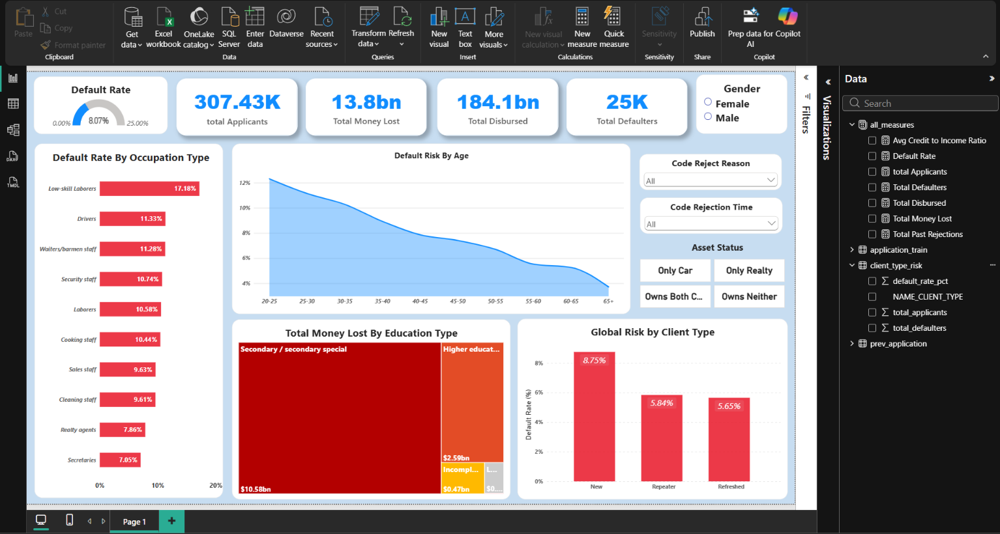

<br>
<br>

# 🏦 Home Credit Default Risk: Portfolio Strategy & Capital Leakage (307K+ Rows)

> **End-to-end financial risk analytics pipeline identifying a $10.58 Billion capital leakage, optimizing the automated underwriting funnel, and deploying strategic LTV caps across 307K+ loan applicants using Python, SQLite, and Power BI.**

---
<br>

🔗 **[Run the Complete Code Live on Kaggle (No Setup Required)](https://www.kaggle.com/code/sauravsingh184/home-credit-risk-portfolio-strategy-python-sql)**<br>
🔗 **[View Interactive Power BI Dashboard (.pbix)](home_credit_dashboard.pbix)**<br>
🔗 **[View Standalone SQL Analytics Pipeline](Queries.sql)**<br>
🔗 **[View Executive Business Presentation (.pptx)](Home_Credit_Analytics_Report.pptx)**

---
<br>

## 📌 Table of Contents

1. **[Executive Summary & Problem Statement](#1-executive-summary--problem-statement)**
2. **[Tech Stack & Cloud Environment](#2-tech-stack--cloud-environment)**
3. **[Data Engineering & Outlier Mitigation](#3-data-engineering--outlier-mitigation)**
4. **[Relational SQL Modeling (CTEs & Window Functions)](#4-relational-sql-modeling-ctes--window-functions)**
5. **[Key Analytical Findings (Capital Leakage & Risk)](#5-key-analytical-findings-capital-leakage--risk)**
6. **[Interactive Power BI Dashboard](#6-interactive-power-bi-dashboard)**
7. **[Strategic Business Recommendations](#7-strategic-business-recommendations)**
8. **[How to Run This Project (1-Click Kaggle)](#8-how-to-run-this-project-1-click-kaggle)**
9. **[Author & Contact](#9-author--contact)**

---
<br>

## 1. Executive Summary & Problem Statement

**The Problem:** High applicant volume does not equal high portfolio quality. The objective of this project was to move beyond basic exploratory data analysis and pinpoint the exact demographic and occupational drivers of loan defaults to mitigate systemic capital leakage.

**The Solution:** By analyzing a massive dataset of 307,433 loan applicants[cite: 2], this project developed a rigorous data pipeline to evaluate historical risk. The analysis exposed critical vulnerabilities in the bank's underwriting process, most notably a **$10.58 Billion capital drain** isolated to a single education demographic[cite: 2].

**Key Strategic Outcomes:**
* **Plugging Portfolio Bleeding:** Proposed strict Loan-to-Value (LTV) caps for the 'Secondary / secondary special' demographic to stop the $10.58B leakage[cite: 2].
* **UI/UX Optimization (80/20 Rule):** Identified that 79.4% of historical loan refusals stem from just two internal limit caps ('HC' and 'LIMIT')[cite: 2]. Recommended a dynamic "Pre-Approved Limit" slider to eliminate wasted underwriting bandwidth.
* **Macro vs. Micro Risk Safeguards:** Designed a dual-pronged strategy to counter systemic volume risk driven by Laborers ($3.11B total loss) versus severe single-ticket risk driven by Managers ($704k loss per default)[cite: 2].

---

<br>

## 2. Tech Stack & Cloud Environment

This project was developed entirely in the cloud to efficiently handle large-scale data manipulation without local hardware constraints.

* **Cloud Environment:** Kaggle Notebooks (for 1-click execution and seamless data hosting)
* **Data Manipulation & EDA:** Python (Pandas, NumPy, Matplotlib, Seaborn)
* **Relational Database & Querying:** SQLite3 (Embedded SQL engine for advanced aggregations, Window Functions, and CTEs)
* **Business Intelligence:** Microsoft Power BI (For executive-level macro dashboards and risk tracking)
* **Version Control & Documentation:** Git, GitHub, Markdown

---

<br>

## 3. Data Engineering & Outlier Mitigation

To ensure the integrity of the financial aggregations and risk metrics, the raw dataset underwent rigorous cleaning and feature engineering in Python (Pandas/NumPy) before being ingested into the SQLite engine.

* **Outlier & Anomaly Purging:** 
  * Excluded extreme right-tail income outliers (>$2.5M) to prevent the distortion of baseline financial aggregations.
  * Identified and neutralized structural anomalies, such as the widely known `365243` days employed error, replacing them with standard Nulls for median imputation.
  * Rectified logical data violations by nullifying mathematically impossible negative down-payment records in the historical applications table.
* **Temporal Feature Engineering:** Transformed uninterpretable negative day offsets (e.g., `DAYS_BIRTH`, `DAYS_EMPLOYED`) into highly intuitive, analyzable metrics like `AGE_IN_YEARS` and `YEARS_EMPLOYED`.
* **Categorical Consolidation:** Aggregated highly granular, fragmented loan intents into definitive macro-categories (e.g., rolling up multiple car-repair/purchase intents into a unified "Vehicle Related" flag) to reduce dimensionality and improve grouping accuracy.
* **Dimensionality Reduction:** Isolated only the statistically significant demographic, financial, and contract features from the original 122-column dataset to optimize SQL query performance and eliminate noise.


---

<br>

## 4. Relational SQL Modeling (CTEs & Window Functions)

Once the data was cleaned and standardized in Python, it was loaded into an embedded SQLite3 database. I leveraged advanced SQL querying to navigate the complex 1-to-Many relationship between current loan applications and historical decision logs.

* **Advanced Deduplication (Window Functions):** When analyzing historical client behavior, joining the tables directly would cause massive row duplication. I utilized `ROW_NUMBER() OVER(PARTITION BY...)` to isolate only the most recent historical application for each client, ensuring 100% data integrity when calculating default risk for 'New' vs. 'Repeater' clients.
* **Common Table Expressions (CTEs):** Used `WITH` clauses to modularize complex queries—such as isolating past refusal flags—before executing `LEFT JOIN` operations with the primary fact table.
* **Dynamic Cohort Segmentation:** Executed advanced `CASE WHEN` aggregations to dynamically group applicants by physical asset liquidity (e.g., 'Only Car' vs. 'Only Realty') and family size dependency to calculate exact portfolio exposure.

**SQL Snippet Example (Handling 1-to-Many Vintage Records):**
```sql
WITH past_app AS (
    SELECT 
        SK_ID_CURR, 
        NAME_CLIENT_TYPE,
        ROW_NUMBER() OVER(PARTITION BY SK_ID_CURR ORDER BY MONTHS_SINCE_DECISION DESC) AS rn
    FROM prev_application
)
SELECT 
    a.SK_ID_CURR, 
    p.NAME_CLIENT_TYPE
FROM application_train a
JOIN past_app p ON a.SK_ID_CURR = p.SK_ID_CURR
WHERE p.rn = 1; -- Ensures only the latest historical interaction is evaluated
```

---

<br>

## 5. Key Analytical Findings (Capital Leakage & Risk)

The exploratory data analysis (EDA) and SQL aggregations moved beyond standard default rates to uncover severe structural vulnerabilities in the bank's lending portfolio. 

* **The $10.58 Billion Leakage:** Applicants with a 'Secondary / secondary special' education make up the bulk of the portfolio[cite: 2]. This specific demographic accounts for a staggering ***76%*** of all defaulted money, equating to a massive **$10.58 Billion** loss for the bank[cite: 2].
* **Macro (Volume) vs. Micro (Severity) Risk:** 
  * *Macro Risk:* 'Low-skill Laborers' are a massive liability, defaulting at ***17.18%***[cite: 2].
  * *Micro Risk:* While 'Managers' account for fewer total defaults, a single defaulting manager costs the bank an average of **$704k**—the highest per-unit loss[cite: 2].
* **The 80/20 Underwriting Bottleneck:** The rejection pipeline is highly skewed, with internal rules ('HC') and limit caps ('LIMIT') driving **79.4%** of all loan refusals[cite: 2]. Processing applications destined to fail wastes massive underwriting bandwidth[cite: 2].
* **The "Cooling-Off" Reality:** Applicants who had a loan rejected within the last 1 year hold a highly elevated **11.88%** default rate[cite: 2]. If the past rejection is older than 1 year, the risk normalizes down significantly to **8.79%**, matching standard baseline levels[cite: 2].
* **The Credit-to-Income Myth:** High loan amounts aren't the real threat[cite: 2]. The Credit-to-Income ratio for Defaulters (**3.88**) and Non-Defaulters (**3.96**) is virtually identical[cite: 2]. The real burden is EMI affordability, which consumes approximately **16%** of a standard client's annual salary, causing cash flow issues[cite: 2].

---

<br>

## 6. Interactive Power BI Dashboard

To synthesize the deep-dive SQL and Python analysis into an accessible format for business stakeholders, I developed a dynamic executive dashboard in Microsoft Power BI. The dashboard is designed to monitor portfolio health and isolate high-risk segments in real-time.



**Core KPIs Monitored:**
* **Total Portfolio Disbursed:** Tracking a massive **$184.1 Billion** in issued capital[cite: 2].
* **Total Money Lost (Capital at Risk):** Visualizing the **$13.8 Billion** lost to defaulted loans across 25K+ defaulters.

**Key Dashboard Features & Interactivity:**
* **Dynamic Slicers (Drill-Downs):** Integrated cross-filtering slicers for *Asset Status* (e.g., 'Owns Both Car & Realty' vs. 'Owns Neither'), *Gender*, and *Code Rejection Time*, allowing executives to instantly drill down into micro-segments.
* **Volume vs. Severity Visuals:** A prominent Treemap explicitly isolates the **$10.58B** 'Secondary / secondary special' education loss, making the largest capital leak instantly visible to non-technical stakeholders.
* **Occupational Risk Mapping:** Bar charts directly map out the exact default rates across high-risk occupations, highlighting 'Low-skill Laborers' at the top with a **17.18%** default rate.

---

<br>

## 7. Strategic Business Recommendations

Based on the data, I proposed actionable strategies to the underwriting team to curb capital leakage and improve operational efficiency:

| Strategic Recommendation | Core Data Insight | Actionable Solution |
| :--- | :--- | :--- |
| **1. Enforce a 12-Month "Cooling-Off" Rule** | Applicants rejected within the last year show a highly elevated **11.88%** default rate. | Automate hard rejections for immediate re-applications within a 12-month window. |
| **2. Restructure "Secondary Education" Contracts** | This single demographic accounts for 76% of all defaulted capital, a **$10.58 Billion** loss. | Enforce strict Loan-to-Value (LTV) caps and route this tier through manual risk committees. |
| **3. Deploy Dual Occupation Safeguards** | 'Laborers' drive massive volume loss ($3.11B), while 'Managers' cost **$704k** per individual default. | Implement automated loan-size ceilings for Laborers and strict asset-backed checks for Managers. |
| **4. Optimize Rejection Pipeline (UI/UX)** | **79.4%** of all refused applications stem from just two internal limit criteria ('HC' and 'LIMIT'). | Deploy a dynamic "Pre-Approved Limit" slider in the UI to prevent over-requesting and save bandwidth. |
| **5. Pivot to Cash-Flow Underwriting** | Credit-to-Income ratios for defaulters (3.88) and non-defaulters (3.96) are identical; the real burden is an EMI exceeding **16%** of salary. | Stop filtering strictly by principal amount; evaluate monthly cash flow and EMI burden instead. |

<br>

---

## 8. How to Run This Project (1-Click Kaggle)

To respect the time of technical reviewers and hiring managers, the entire Python data processing and SQL analytics pipeline has been hosted on Kaggle for zero-setup, 1-click execution.

* **Run the Full Pipeline (Cloud):** [View and run the Kaggle Notebook Here](https://www.kaggle.com/code/sauravsingh184/home-credit-risk-portfolio-strategy-python-sql)
* **View Standalone SQL Queries:** For reviewers purely interested in the SQL architecture (CTEs, Window Functions, Aggregations), view the `Queries.sql` file in this repository.
* **View the Executive Presentation:** The final business slides can be viewed in the `Home_Credit_Analytics_Report.pptx` file.


---

<br>

## 9. Author & Contact

**Saurav Singh**  
*Data Analyst | SQL, Python, Excel & Power BI*

* **Email:** [sauravgusain184@gmail.com](mailto:sauravgusain184@gmail.com)
* **GitHub:** [@saurav-18s](https://github.com/saurav-18s)
* **LinkedIn:** [@saurav-singh-1844s](https://www.linkedin.com/in/saurav-singh-1844s)
* **Kaggle:** [@sauravsingh184](https://www.kaggle.com/sauravsingh184)